# AULA 22/02
## Paradigma Orientado a objetos
- Abstração digital do mundo real
- Está relacionado com a ideia de classificar, organizar e abstrair as coisas
- "O termo orientação a objetos significa organizar o mundo real como coleção de objetos que incorporam estrutura de dados e um conjunto de operações que manipulam estes dados"
- Objeto combina estrutura e comportamneto em uma única entidade
### Classe
- Classe é o agrupamento de coisas que compartilham coisas em comum, uma reunião de objetos que contem uma mesma característica
### Objeto
- Objeto é a instancia de uma classe, cada objeto tem as suas individualidade
### Atributos
- Os atributos são as características de cada objeto
### Métodos
- Os métodos são as ações dos objetos

## Classe
- É a principal estrutura da POO
- Reúne todas as características e os serviçoes disponiveis por seus objetos.
- Servem para especificar (modelo)
- Funciona como uma receita de bolo
- É a Classe que contêm os métodos e os atributos
- As classes são **Estáticas**

## Objetos
- São as criações/instâncias feitas a partir da classe

## Classe X Obejeto
- Todo objeto é algo que existe
- A classe é considerada como um modelo ou preojeto de um objeto, sendo algo que não consegue tocar

## Identificação dos Objetos
- Identificamos os objetos que fazem parte deste cenério
- Separamos apenas os objetos que são relevantes ao problema em questão
- Abstrairemos somente as **Ações e atributos** relevante dos objetos envolvidos

## Atributos
- Os atributos são propriedades de um objeto
- Essas propriedades definem o estado de um objeto
- Mostra as características de um objeto, mas os valores que são guardados nas variáveis são diferentes variando para cada objeto

## Métodos
- Os métodos são ações ou procedimentos, onde podem interagir e se comunicarem com outros objetos
- A execução dessas ações se dá através de mensagens, tendo como função o envio de uma solicitação ao objeto para que seja efetuada a rotina desejada
Como boas prátocas, é indicada sempre usar o nome dos métodos declarados como verbos, para que quando for efetuada alguma manutenção seja de fácil entendimento. Veja algumas nomenclaturas de nomes de métodos: **Andar, Falar, Comer**

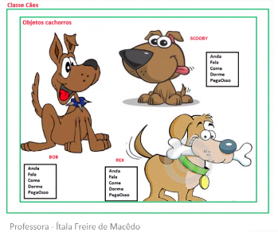

## UML - Linguagem de Modelagem Unificada
### História
- inicio do paradigma Orientado a Objetos
- Vários métodos surgiram
#
- Foi criada para estabelecer uma linguagem de modelagem visual comum, semanticamente e sintaticamente rica, para arquitetura, desing e implementação de software complexos, tanto estruturalmente quanto para comportamentos
### Benefícios
- Fácil visualização
- Obtem as especificação desejada
- Facilita a comunicação entre pessoas
#
- Descrevem o limite, a estrutura e o comportamento do sistema e os objetos nele contidos
- **É uma linguagem poderosa para a comunicação em equipes de produção**
- Esta linguagem pe expressa através de diagramas. Cada diagrama pe composto por elementos(formas gráficas usadas para os desenhos) que **possuem relação** entre si

### Caso de uso
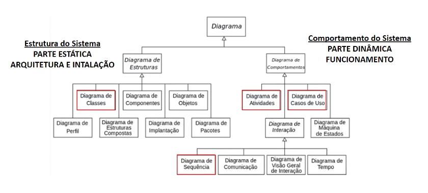

- Diagrama mais geral da UML
- Usado geralmente na fase de especificação de requisitos
- Quais usuários realizam que funcionalidades do sistema
- Alguns relacionamentos entre estas funiconalidades
#
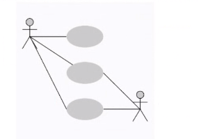
#
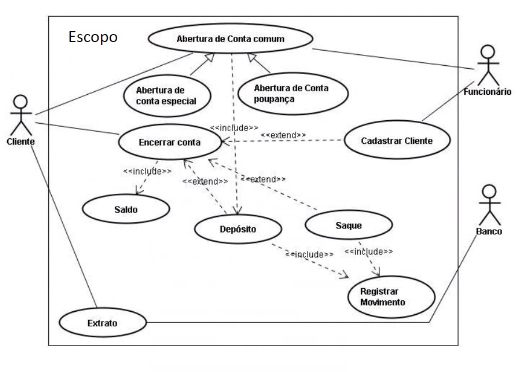

- **INCLUDE**  é obrigatório que um caso seja executado para que o outro exista
- **EXTEND** Ele é opcional, opções que o usuário terá

- **ATORES**: os **usuários** que interagem com o sistema. Ator pode ser uma pessoa, organização ou sistema externo que interage com seu aplicativo ou sistema. Eles devem ser objetos externos que prouzam ou consumam dados.

- **SISTEMA**: **uma sequência** específica de **ações e interações** entre os atores e o sistema. também podem ser chamado de cenério

- **META**: O resultado final damaioria dos casos de uso. Um diagrama criado corretamente deve descrever as atividades e variantes uasadas para atingir a meta

#
### Símbolos e notação do diagrama de caso de uso
- **Caso de uso**:Formato oval na horizontal e que representa os diferentes usos que um usuário pode ter
- **Atores**: bonecos de palito, representando as pessoas que realmente implementam os casos de uso
- **Associações**: uma linha entre atores e casos de uso

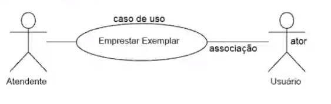

### Relacionamentos enre casos de uso
- **Generalização** (herança) é aquele no qual um elemento de modelo (o filho) tem como base outro elemento modelo (o pai)

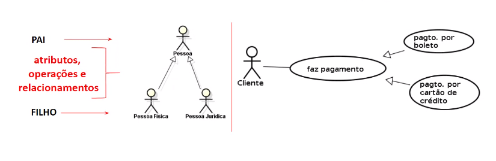

- **Include**:

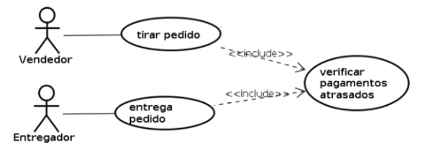

- **Exetend**:

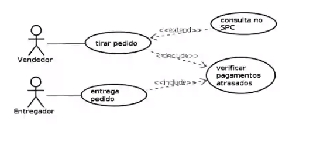

## Atividade em sala
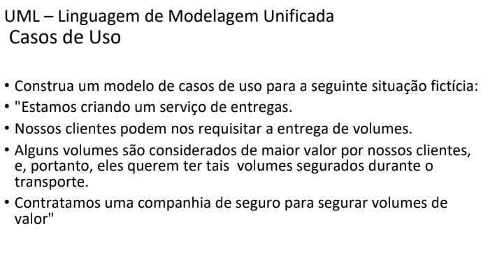
- Resposta:

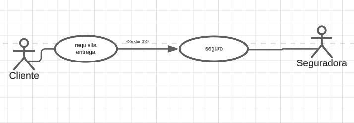

- Clínica Veterinária

•O cliente se dirige a clínica onde marca uma consulta com a secretária levando seu animal. Caso não sejam cadastrados,a secretaria deve cadastra-los.

•Em cada sessão,o cliente deve informar os sintomas. O animal pode ter que passar por várias consultas, dependendo do diagnóstico.

•Durante a consulta, o veterinário pode solicitar exames a serem tragos na próxima consulta.

•A cada seção gera-se um histórico e uma conta

A Secretária tem responsabilidade de manter atualizado os cadastros dos Clientes, Veterinários e Animais.

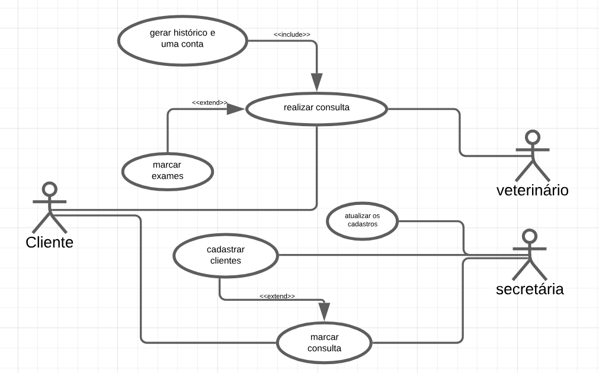