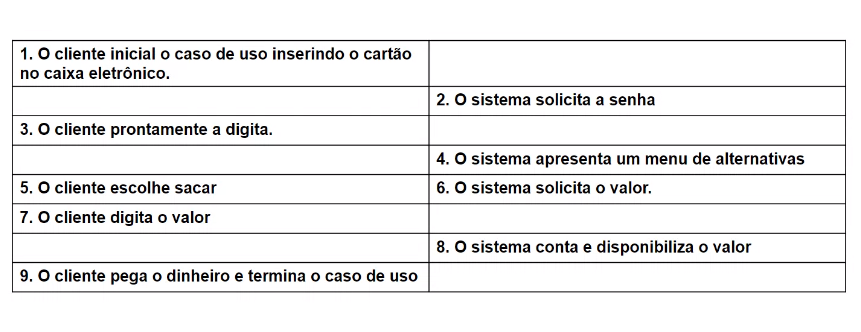

# Aula 29/02

## Correção atividade:

## UML - Casos de uso Relembrando
- Indica "O que o sistema faz"
- Casp de isa captura uma função visível do sistema
- O que o sistema faz e como um usuário interage com o sistema
- Qual papel do usuário
- Objetivos
- Fluxo das operações
- identifique os atores
- Para cada ator, verifique quais os objetivos deles quando estão diante do sistema
- Organize os casos de uso no diagrama
### Estabeleça a realação entre os casos de uso
- Onde existe relações de uso?
- Onde existe relação de extensão?
- Onde existe relação de herança? 

## Especificação do caso de uso
- A especificação do caso de uso visa detalhar a forma como um objetivo é atingido pelo ator
- Vle lembar que um caso de uso é sobretudo uma narrativa de como uma determinada atividade pe executo pelo ator perante o sistema

### Cabeçalho
- Identificador
- Nome 
- Descritivo
- Atores
- Pré-condição
- Pós-condição

### Fluxo
- Normal
- Alternativo
- Excepcional

## Cabeçalho
### Identificador
- Dica: estabelecer uma nomenclatura, por exemplo, com módulo e número do caso de uso
- Permite relacionar outras informações do caso de uso
- Exemplo: CAD001 , SEG001

### Nome
- Um texto simplificado que indica o que o caso de uso faz
- Dica: Verbo no infinitivo ou no presente
- Exemplo: Cadastrar cliente, vender, autenticar usuário

### Atores
- Lista de atores que interagem com o caso de uso
- Destacar o ator principal
- Exemplo: Atores: Cliente e atendente

### Descritivo
- Uma breve descrição do caso de uso

### Pré-Condição
- Uma condição que deve ser satisfeita antes do caso de uso ser executado
- Exemplo: Para sacar o dinheiro o cliente deve estar autenticado no sistema

### Pós-Condição
- Uma situação ou condição que é satisfeita após realização do caso de uso
- Exemplo: Usuário autenticado para usar qualque parte do sistema

## Fluxo
- É o coração do caso de uso, indica "o que o sistema faz" e como um usuário interage com o sitema
- Podem ser: Fluxo normal, Alternativo, Excepcional

### Fluxo Normal
- Registra a sequencia das ações tanto do usuário como do sistema quanto tudo dá certo na operação

### Fluxo em si:

1. Inicia como ator principal disparando o caso de uso

2. Continua com as interações entre ator e caso de uso

3. Conclui com uma das partes terminando o caso de uso

- Existem várias formas de expressar o fluxo normal do caso de uso
### Formas de Apresentação:

1. Texto simples

2. Texto enumerado

3. Texto enumerado

4. Quadro ator versus sistema

5. Fluxo de atividade

## Exemplo 
### Texto simples

### Texto enumerado

### Formato tabulado

## Fluxo Alternativo
- Quando o usuário decide mudar o fluxo em alguma parte do fluxo normal
- Por exemplo nas ações 2 e 3: **Caso o usuário ele pode cancelar a operação**

## Fluxo Excepcional
- Quando o sistema detecta algum problema e decide desviar o fluxo
- Por exemplo na ação 7: **Caso o sistema perceba que não há saldo ele informa o cliente e solicita novo valor.**

## Atividade
• A empresa Master Soluções de TI realiza serviços de desenvolvimento de
sistemas ou implantação de redes. Quando um Cliente solicita um serviço
ele é cadastrado no sistema e é criado um projeto para o serviço solicitado.
O gestor do projeto uma vez com o projeto cadastrado pode quebrar a
execução em atividades que são alocadas a membros das equipes. No
cadastro das atividades são registrados dados de prazos em datas e esforço
em horas. Tanto informações de previsão como posteriormente da
execução das atividades são realizadas. Um membro da equipe uma vez
com uma atividade alocada pode visualizar suas atividades e conforme
execução ele registra os andamentos. Com os dados cadastrados e os
andamentos posicionados pela equipe, o gerente de projeto pode
visualizar e acompanhar a execução dos projetos.

