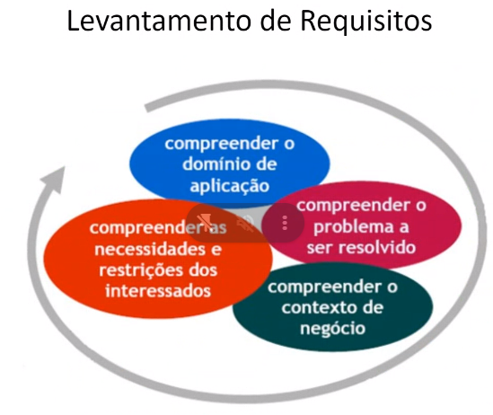
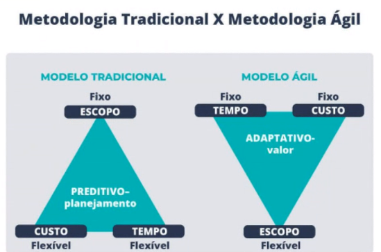
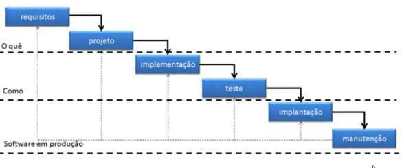
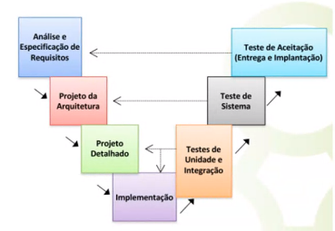
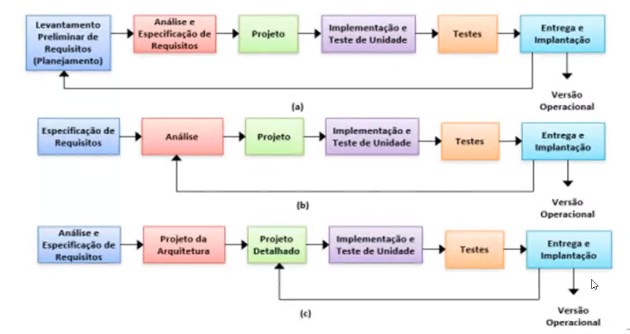
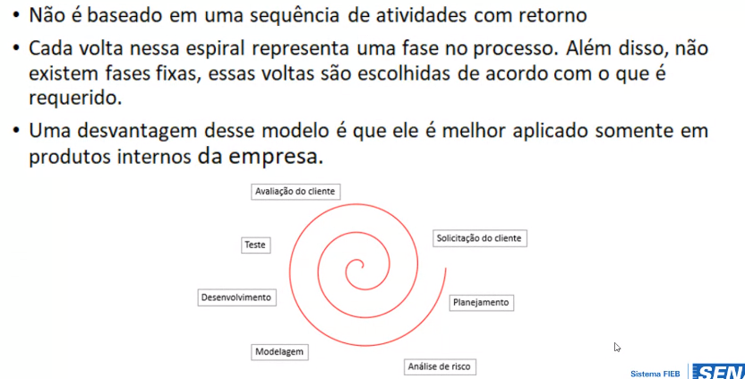
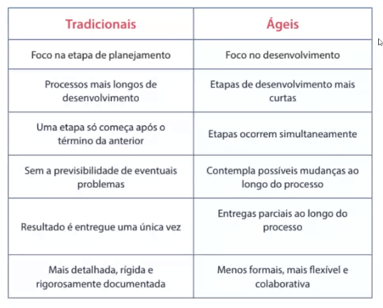
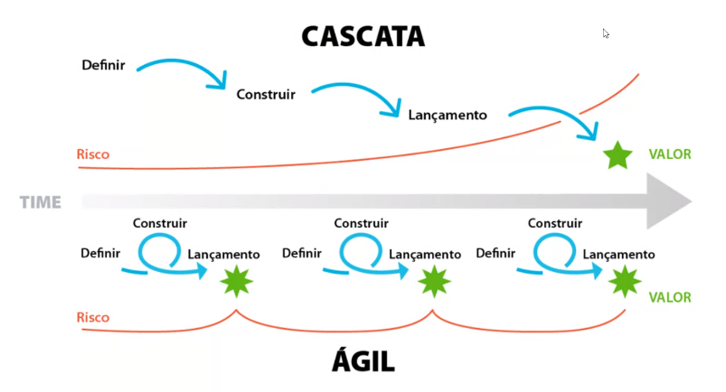

# 21/03

## Levantamento de requisitos

## Cliclo de vida do Projeto de  Software
- 1- Levantamento de requisitos
- 2- Análise
- 3- Projeto
- 4- Iplementação
- 5- Testes
- 6- Implantação
- 7- Manutenção

## Metodologia de desenvolvimento

## Metodologia Clássica 

### Modelo Cascata
- Uma das primeiras abordagens no desenvolvimento de software
- Cada fase deve ser completada antes que outra inicie

- Os requisitos são bem documentados, claros e fixos
- A definição do produto é estavel, sem previsão de mudanças ao longo
- A tenologia é bem compreendida e não é dinâmica
- O projeto é pequeno e realizado em curto tempo

### Modelo sequencial V
- Enfatiza a estreita relação entre as atividade de teste e as demais fases do processo.

### Modelo incremental
- Esse modelo foi criado como uma melhoria do modelo cascata e também é um modelo tradicional
- É um modelo ideal caso os requisitos não estejam tão claros
- O foco é a entrega de cada incremento, a funcionalidade do sistema estará disponível mais cedo para o usuário

### Modelo espiral

## Metodologias Ágeis
- Desenvolvimento iterativo-Evoluem ao longo do tempo
- Ágil habilita os times a entregar valor mais rápido, com maior qualidade, e com maior capacidade de responder a mudanças aumentando a satisfação do cliente

