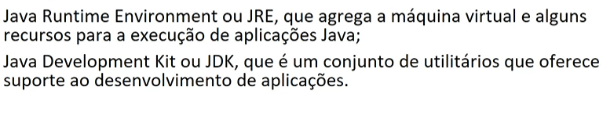
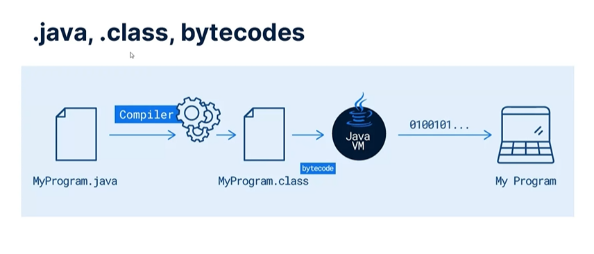
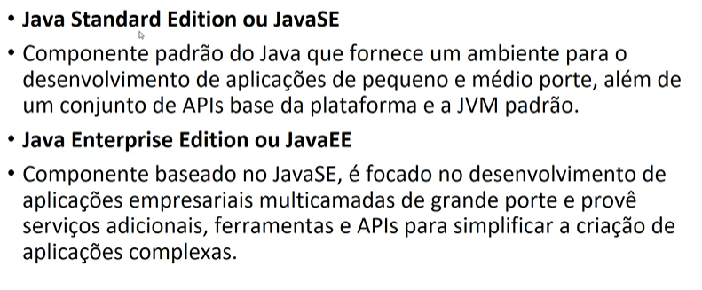

# Aula 28/05

## Ambiente JAVA
- O java, como plataforma de programação, nasceu no ano de 1995 dentro dos laboratórios da empresa Sun como resultado de uma extensa pesquisa Corporation científica e tecnológica. Em 2008 foi adquirido pela empresa Oracle

- Uma linguagem de programação de alto nível orientada a objetos
- A plataforma Java entraga um ambiente completo para o desenvolvimento e execução de programas
- Máquina Virtual(Java Virtual Machine ou  JVM), que garante a independência de plataforma, pois o código executa na máquina virtual e essa pode ser portada para outras plataformas para outras plataformas como windows ou Linux

### Como o programa funciona

### Tecnologia Java

