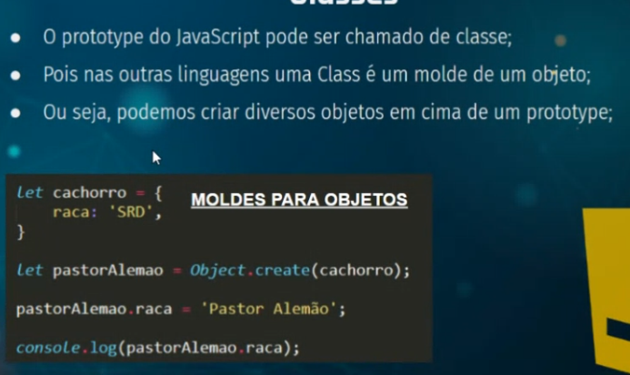

# Aula 06/06

## O que é orientação a objetos?
- Uma forma de programar, que utiliza os seus objetos como seu principal princípio
- Além de utilizar conceitos e técnicas que envolvem objetos
- A maioria dos softwares, na parte back-end, são desenvolvidos em cima desse paradigma
- Grandes frameworks se aproveitam dessa técnica

## Métodos

## Prototypes

## Classes

## CLasses: Construtor por função

## Classes: Construtor por new
 - Em muitas linguagens temos a possibilidade de instanciar um objeto com new, no JS também

 